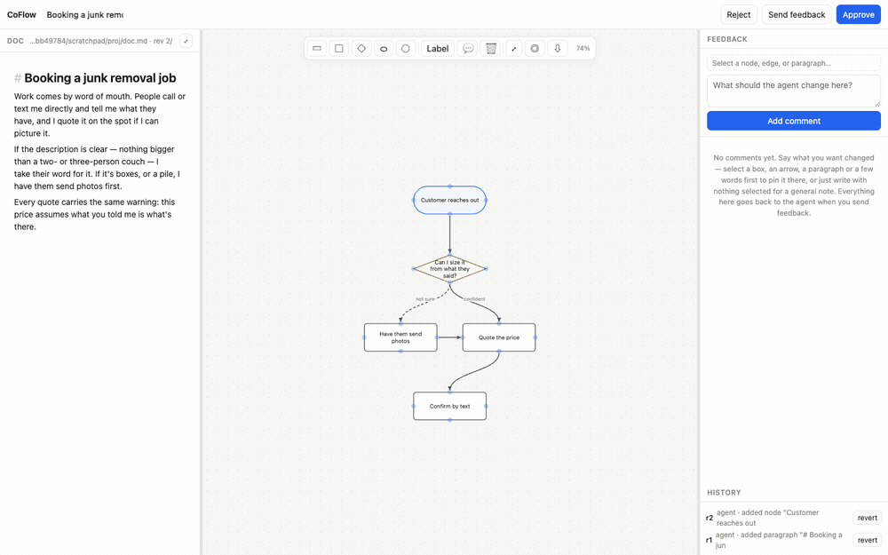
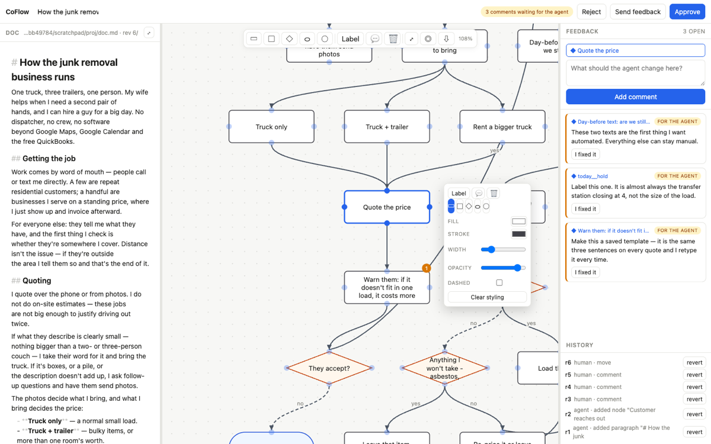
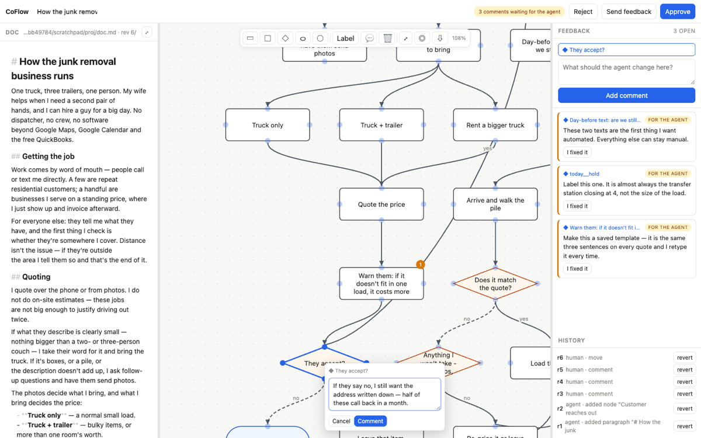
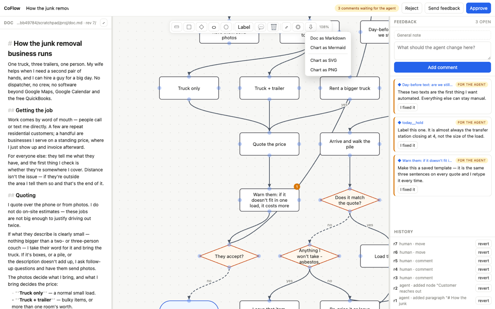
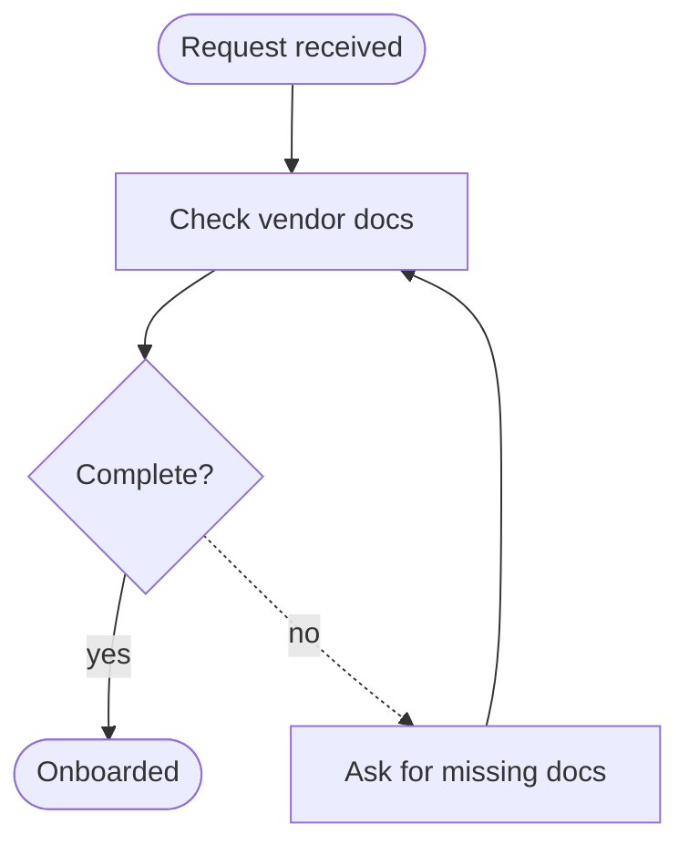

# CoFlow

**Your coding agent writes the plan. You fix it by hand. It gets your edits back.**

CoFlow is a flowchart canvas and a markdown editor behind a Plannotator-style review loop.
An agent hands you a document and a diagram, opens localhost in your browser, and
**blocks** — the command just sits there. You drag boxes, redraw arrows, rewrite the prose,
and leave comments. Then you hit **Approve**, **Send feedback**, or **Reject**, and
everything you produced goes back to the agent on stdout.

No API key. No database. No background daemon. No dependencies — not one. The agent that
launched it is the AI.



*One pass through the loop — moving a box, drawing a new step, restyling a decision, leaving a comment, sending it all back.*

## Quick start

```bash
npx coflow plan.md --flow flow.mmd --json --gate
```

The browser opens. When you decide, the command prints a decision JSON and exits `0` on
approve, `1` otherwise. Without `--json` it prints prose an agent can read directly.

```
coflow <plan.md>                    open the editor on a markdown plan
coflow - --flow flow.mmd            read the plan from stdin
coflow "Vendor onboarding"          open an empty project with that title
coflow attach <DIR>                 print the handoff for a project you saved earlier

  --flow FILE          seed the main flow: FILE.mmd is Mermaid, FILE.json is a graph with
                       props / status / docRefId. Repeat with NAME=FILE for more flows
  --save-dir DIR       project folder (default ./coflow)
  --json               print the decision as JSON instead of prose
  --gate               exit codes: 0 approved, 1 changes requested / rejected, 2 usage error
  --result-file PATH   also write the decision JSON to PATH
  --no-open            don't launch a browser
```

## The loop

1. The agent writes a doc and a Mermaid chart, then runs `coflow`.
2. You edit. Everything you touch is logged in plain English.
3. You **Approve** (final — build against it), **Send feedback** (every comment is an
   instruction; the agent revises and reopens the same folder), or **Reject** (stop).
   Closing the tab counts as a dismissal too: the server lives only while a tab is on it and
   exits on its own about 30 seconds later, so no stray servers pile up.
4. Re-running against the same `--save-dir` keeps your work. **Every box you moved stays
   where you put it** — the agent supplies semantics, you own the geometry.

What the agent gets:

```json
{
  "decision": "annotated",
  "feedback": "close, but see the comment",
  "comments":  [{ "id": "c_sxl5ks", "target": "flow Reject", "body": "drop this branch" }],
  "humanOps":  ["relabelled edge q__c to \"after 30 days\"", "removed node \"Reject\" (c)"],
  "doc":       "# Vendor onboarding\n\nFirst we check the vendor…",
  "mermaid":   "flowchart TD\n  a([\"Start\"])\n  a --> q{\"Valid?\"}…",
  "flows":     { "main": { "mermaid": "…", "graph": { "dir": "TD", "nodes": [{ "id": "a", "label": "Start", "props": { "actor": "rep" } }], "edges": [] } } },
  "version": 7,
  "dir": "/abs/path/to/coflow"
}
```

`humanOps` is the log of what you changed by hand, so the agent doesn't re-add the node you
just deleted. Comments you marked *I fixed it* move to `resolvedComments`. `mermaid` is the
main flow; `flows` is every flow, as Mermaid and as the full graph — that is where `props`,
`status` and `docRefId` come back, since Mermaid cannot carry them.

## The canvas

Select anything and a panel opens **beside** it — never on top of the thing you're editing,
because you still need to drag the end of that arrow.



- **Arrows.** Every box shows four blue dots. Drag one onto another box to connect them.
  Click one, or drop it on empty canvas, and you get the next step a clear box-width away.
  Arrows leave and arrive square to a box side, weighted by how big the boxes actually are —
  so a fan-out leaves the bottom and lands on the top, the way a flowchart should read.
- **Re-route.** Click an arrow and drag either end onto another box; drop it on a blue dot
  to pin which side it attaches to.
- **Labels.** Double-click an arrow to write `yes` / `no` / whatever the branch means.
  Double-click a box to rename it.
- **Shapes.** rectangle `[]`, rounded `()`, stadium `([])`, circle `(())`, diamond `{}`.
  Made a box and meant a decision? The five shapes sit in the panel; switching keeps every
  arrow attached.
- **Resize.** Drag any box's edge or corner — no need to select it first. The side you grab
  moves, the opposite one stays put, and the label rewraps: wider means more words per line,
  taller means more lines. The blue dots keep the middle of each side, so drawing an arrow
  still wins there.
- **Dashed.** One checkbox, two meanings. On an arrow it is Mermaid's `-.->`, so it is
  semantics and rides back to the agent. On a box Mermaid cannot say it at all, so it is
  yours and survives a re-seed.
- **Copy.** `⌘C` / `⌘V` duplicates the selected boxes, the arrows between them, and their
  styling — dropped just off the originals and already selected, ready to drag away.
- **Branch by keyboard.** With a box selected, `⌘`+arrow makes one box that way and draws
  the arrow. Press it again and the branch *splits*: two equally spaced siblings, then
  three, then four. Unnamed boxes show dashed; `Enter` names the selected one and ends the
  branch, `Escape` just ends it, `⌘Z` takes one back.
- **Select.** Drag the empty canvas to rubber-band; space / alt / middle-drag pans instead.
  `Del` deletes the selection, `⌘Z` steps back a revision.

Position, size, styling, dashes on a box, and which side an arrow attaches to are **yours**:
Mermaid cannot express them, so they live in `flow.json` and survive the agent handing back
a new chart. Shape and arrow style are **not** — those are semantics, and they round-trip
through Mermaid like the labels do.

### Flows, props, proposals, links

- **Several flows per project.** A dropdown in the title bar: one process each — quote,
  dispatch, invoice. Its ⋯ menu renames, deletes, or adds one. Seed them with `--flow name=file`.
  A box whose `flow` prop names another flow gets an ↗ and *Open flow* on right-click.
- **Props.** Select one box or arrow and the panel shows key/value rows: actor, system, SLA,
  CRM property, whatever the process needs. Mermaid cannot carry them, so the agent seeds
  them through a `.json` flow and gets them back in `flows[name].graph`. Yours survive a
  Mermaid re-seed, and the agent's new ones merge over the top.
- **Proposed.** The agent marks a node or arrow `status: "proposed"`; it draws green and
  dashed. Untick *Proposed* or right-click → *Accept this proposal* and the log says so.
  There is no side-by-side: the current state is the chart, proposals are drawn onto it.
- **Link a box to a paragraph.** Select boxes, right-click the paragraph, *Link … to this
  paragraph*. The box shows ¶, picking it lights the paragraph up, and a comment on either
  side lands where it belongs. `docRefId` rides along in the graph.

## The doc

Markdown, live: `**bold**`, `*italic*`, `` `code` ``, `~~strike~~`, links, `#`/`##`/`###`,
`>` quotes, lists and fences render as you type, with the markers left in place so what you
see is exactly what the agent gets.

Don't write markdown? Highlight some words and a bar appears: bold, italic, code, strike,
headings, bullets, quote, link. `⌘A` selects the whole document, not just the paragraph
you're standing in. `⤢` gives the doc the entire window.

A markdown pipe table renders as a grid you edit cell by cell — no pipes, no separator row
to get wrong. Right-click a cell to add or delete rows and columns; right-click any
paragraph for *Insert a table below*. Under the hood it is still a pipe table in `doc.md`,
so the agent reads a mapping table as plain markdown.

## Comments

A comment is an **instruction, not a proposal** — nothing closes it but you clicking
*I fixed it*.



Select a box, an arrow or a paragraph — or highlight a few words and hit 💬 to pin the
comment to exactly those words — then write what you want changed. With nothing selected you
get a general note about the project. Right-click anything and the box opens where you
clicked, so you never lose sight of what you are talking about. Pins show on the canvas, the
header counts what is waiting, and resolved ones leave the rail (`Show N resolved` brings
them back).

## Share it



`⇩` downloads the doc as Markdown, the chart as Mermaid, or the chart as a picture — SVG, or
a 2× PNG to paste into a chat. The picture is cropped to the drawing and carries its own
styling, so it looks right somewhere that has never heard of CoFlow.

## The folder is the database

```
coflow.json      rev, title, updatedAt
doc.json         { blocks: [{ id, text }] }
doc.md           same doc, flat markdown
flows/NAME.json  { dir, nodes: [{id,type,label,x,y,w,h,color,stroke,sw,opacity,dash,props,status,docRefId}], edges: […] }
flows/NAME.mermaid  same graph, Mermaid source (a legacy top-level flow.json still opens, as `main`)
comments.json    [{ id, target, body, status }]
versions/N.json  state as it was *before* rev N, plus `ops`: what that write did
handoff.md/json  written when you decide — including the verdict, so the folder itself
                 knows whether it holds a final document or a draft
```

Every write bumps `rev` and snapshots the previous state, so history is revertible from the
sidebar. `coflow attach <dir>` prints that history for a later session, and its first line
says where things stand: `**draft**`, `**approved** by the human at rev N`, or `**approved**
at rev N, then edited 3 more time(s) — no longer final`.

## Mermaid profile

`flowchart`/`graph`, directions `TD|BT|LR|RL`, the five shapes above, edges `-->` and `-.->`
with `|label|`. No subgraphs, classes, HTML labels, or edge styling. Edge ids are canonical
`from__to`, one per ordered pair. **Anything off-profile is rejected before anything is
written** — a chart with `==>` fails loudly rather than quietly becoming a node label.



## Tests

```bash
npm test
```

10 tests: Mermaid round-trip across all five shapes (plus legacy shape names), profile
rejection, position and size preservation across an agent re-seed, layout idempotence and
non-overlap, diff + lint, the plain-English change log, and store snapshot / undo / handoff.

## Plugins

One skill drives all three hosts — `plugin/skills/coflow/SKILL.md` is the only real
artifact; each manifest just points at it.

```
plugin/
├── skills/coflow/SKILL.md       when to run it, the Mermaid profile, how to read the result
├── commands/coflow.md           the /coflow slash command
├── .claude-plugin/plugin.json   Claude Code manifest
└── plugin.json                  Codex / agent-plugins.org manifest
.claude-plugin/marketplace.json  Claude Code marketplace
.agents/plugins/marketplace.json Codex marketplace
package.json → "pi": {…}         Pi package manifest
```

```bash
# Claude Code
/plugin marketplace add adamchu22/coflow
/plugin install coflow@coflow

# Codex
codex plugin marketplace add adamchu22/coflow

# Pi
pi install adamchu22/coflow
```

All three expect `coflow` on PATH. It is not on npm yet, so link it from a clone:

```bash
git clone https://github.com/adamchu22/coflow && cd coflow && npm link
```

Node 20+. Nothing else.

## Licence

MIT — © 2026 Rugby Waldorf LLC. See [LICENSE](LICENSE).

No third-party code ships here (there are no dependencies at all), but the ideas came from
somewhere: [CREDITS.md](CREDITS.md) names them.
