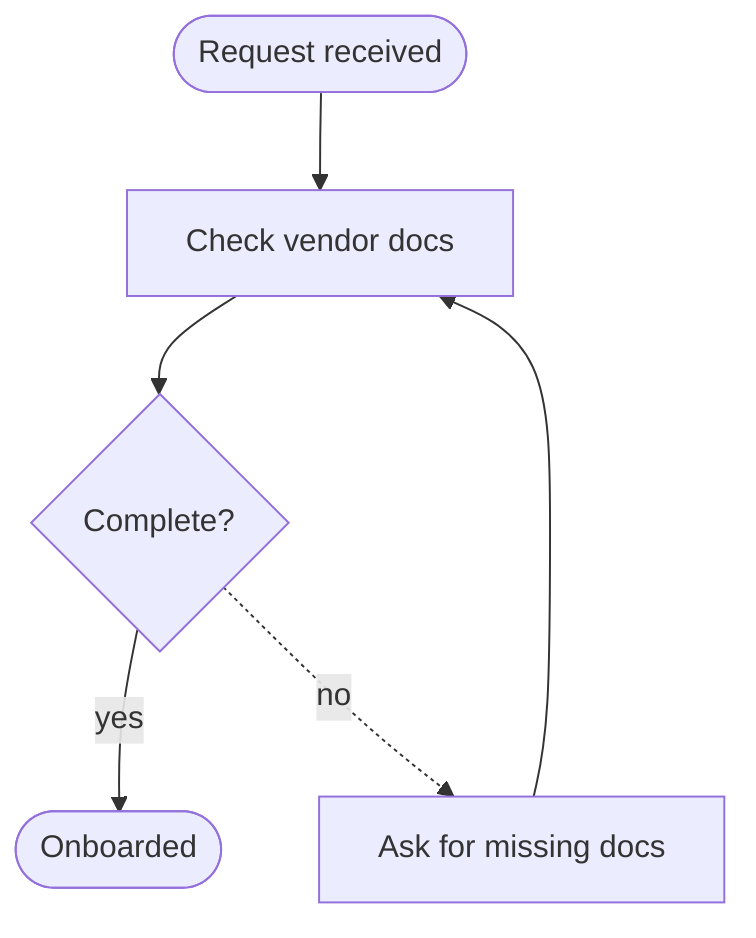

# CoFlow

A review loop, not a renderer. You write the plan and the chart, the human rewrites them
by hand, and you get their edits back. Nothing here talks to a model — you are the AI.

## Run it

```bash
coflow plan.md --flow flow.mmd --json --gate --save-dir ./coflow
```

**It blocks.** The browser opens and the command sits there — for minutes, maybe an hour —
until the human decides. That is the point. Do not background it, do not poll it, do not
set a short timeout, and do not start other work while it runs. Wait.

When it returns, stdout is the decision JSON and the exit code is `0` approved,
`1` changes requested or rejected, `2` bad invocation.

Other forms:

```bash
coflow - --flow flow.mmd            # plan on stdin
coflow "Vendor onboarding"          # empty project, human draws it
coflow attach ./coflow              # re-read a project from an earlier session
```

## Write the chart first

Seed the canvas so the human edits something instead of facing a blank page. CoFlow reads
a deliberately small Mermaid subset and **rejects anything outside it rather than guessing**:

- `flowchart` or `graph`, direction `TD` `BT` `LR` `RL`
- five shapes: `a[Step]` `b(Rounded)` `c([Start/End])` `d((Terminator))` `e{Decision?}`
- edges `-->` and `-.->`, labelled `-->|yes|`
- no subgraphs, no `classDef`, no `==>`, no HTML labels



## Read the result

```json
{
  "decision": "annotated",
  "feedback": "close, but see the comment",
  "comments": [{ "id": "c_sxl5ks", "target": "flow Reject", "body": "drop this branch" }],
  "humanOps": ["relabelled edge q__c to \"after 30 days\"", "removed node \"Reject\" (c)"],
  "doc": "# Vendor onboarding…",
  "mermaid": "flowchart TD…",
  "version": 7,
  "dir": "/abs/path/to/coflow"
}
```

Then:

- **`approved`** — this is the final document. Build against it and do not re-litigate the
  design. The folder records the sign-off, so later sessions can tell it apart from a draft.
- **`annotated`** — every comment is an instruction, not a suggestion. Carry them all out,
  then **run `coflow` again against the same `--save-dir`** so they can see the revision.
  That is the loop: annotate → revise → reopen, until they approve. Only the human closes a
  comment, so never mark one resolved yourself.
- **`dismissed`** — stop and ask what they want instead.

**`humanOps` is the list of edits they made by hand.** Read it before you touch the chart
again: re-adding a node they just deleted is the fastest way to lose their trust. The same
goes for layout — their positions, styling, and arrow attachment points are theirs and
survive you sending a new chart, so send semantics and leave the geometry alone.

## The folder

`--save-dir` defaults to `./coflow` in the current directory, and it persists after the
session: `doc.md`, `flow.mermaid`, `comments.json`, `handoff.md`, and a `versions/`
snapshot per edit. Commit it if the document belongs with the code; `versions/` is undo
history and can be ignored.

`coflow attach <dir>` prints the lot for a later session, and its first lines say where
things stand — `**draft**`, `**approved** by the human at rev N`, or `**approved** at
rev N, then edited 3 more time(s) — no longer final`. Check it before assuming anything
is settled.

## Install

`coflow` must be on PATH: `npm i -g coflow`, or run it as `npx coflow`. Node 20+, no
other dependencies.
